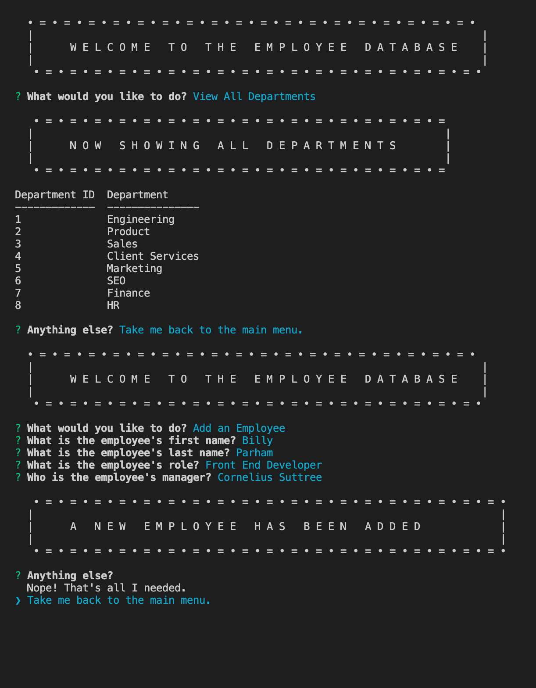

# Interactive CLI Employee Database
  


  ## Table of Contents
  * [Description](#description)
  * [Installation](#installation)
  * [Usage](#usage)
  * [License](#license)
  * [Contribution Guidelines](#contribution-guidelines)
  * [Tests](#tests)
  * [Questions](#questions)
  

  ## Description  
  Conveninently manage your organization's departments, roles, and employee data with this user-friendly command-line application. 


  ## Usage
  - Initialize the program with the command ```npm start``` or ```node index``` 
  - [Tutorial video here.](https://drive.google.com/file/d/1tZEYnArRZAYUVdgxLk_bwO42hMwH4Cir/view)

  


  ## License
  This project is covered under Unlicense.


  ## Contribution Guidelines
  It's chaos; be kind. 


  ## Questions
  Please direct all inquiries to [jessicajernigan](https://github.com/jessicajernigan) via email at: [jernigan.jessica.leigh@gmail.com](mailto:jernigan.jessica.leigh@gmail.com?subject=Question%20About%20Interactive%20CLI%20Employee%20Database)

